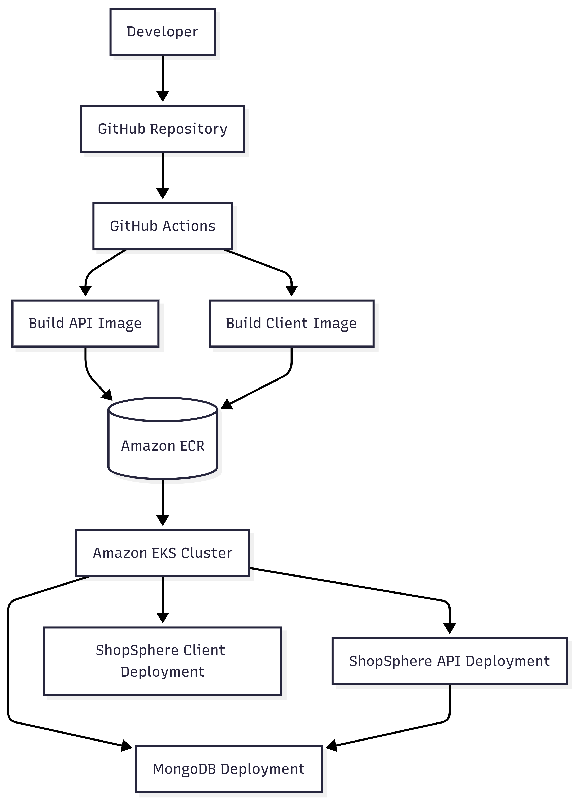
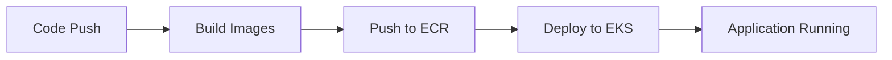

# 🚀 Docker & Kubernetes for .Net and Angular Developers

[](https://www.udemy.com/course/docker-for-net-and-angular-developers/?referralCode=60C74EE89BE626D6033D)

## 🧠 Overview

ShopSphere is a full-stack microservices application demonstrating a real-world **end-to-end DevOps workflow**:

- 🧩 .NET API (Backend)
- 🎨 Frontend Client
- 🗄️ MongoDB (Database)
- 🐳 Dockerized Services
- ☸️ Kubernetes (Amazon EKS)
- ☁️ AWS ECR (Container Registry)
- ⚙️ GitHub Actions (CI/CD)

This project walks through the journey from **local development → containerization → cloud deployment → automation**.

---

## 🏗️ Architecture


🔹 Build & Run API

```bash
docker build -t shopsphere-api:v1 -f ShopSphere.API/Dockerfile .
docker run -d -p 8080:8080 \
  -e ASPNETCORE_ENVIRONMENT=Development \
  --name shopsphere-api-v1 shopsphere-api:v1
  ```

🔹 Build & Run Client

```bash
npm run build -- --configuration production

docker build -t shopsphere-client:v1 -f ShopSphere.Client/Dockerfile ./ShopSphere.Client
docker run -d -p 4200:80 --name shopsphere-client-v1 shopsphere-client:v1
```

🔹 Run MongoDB

```bash
docker run -d --name shopsphere-mongo -p 27017:27017 mongo:7.0
```

🌐 Docker Networking (Microservices Communication)

```bash
docker network create shopsphere-network

docker run -d --name shopsphere-mongo \
  --network shopsphere-network mongo:7.0

docker run -d --name shopsphere-api-v2 \
  --network shopsphere-network \
  -p 8080:8080 \
  -e ASPNETCORE_ENVIRONMENT=Development \
  -e MongoDb__ConnectionString=mongodb://shopsphere-mongo:27017 \
  -e UseInMemory=false \
  shopsphere-api:v2
```

🚀 AWS CLI Configuration for ECR (Docker Deployment)

This guide explains how to configure AWS CLI to authenticate and interact with Amazon ECR for Docker image push/pull.

📌 Prerequisites

Before proceeding, ensure:

- AWS account is created
- IAM user is created with permissions:
   - AmazonEC2ContainerRegistryFullAccess
   - AmazonS3FullAccess --> for S3
- Access keys are generated for the IAM user
  - 🔐 Step 1: Create Access Keys
  - Go to AWS Console → IAM → Users
  - Select your user (e.g., ecr-user)
  - Navigate to Security Credentials
  - Click Create Access Key
  - Choose:
  - Use case: Command Line Interface (CLI)
  - Copy:
      - ✅ AWS Access Key ID
      - ✅ AWS Secret Access Key

- ⚠️ Save the secret key securely (shown only once)

⚙️ Step 2: Configure AWS CLI

Run the following command:

aws configure

Enter the following details:

- AWS Access Key ID: <your-access-key>
- AWS Secret Access Key: <your-secret-key>
- Default region name: us-east-1
- Default output format: json

🌍 Region Information
- Ensure region matches your ECR repository region
- Example:
ECR URL: xxxx.dkr.ecr.us-east-1.amazonaws.com
Region: us-east-1
- ✅ Step 3: Verify Configuration

Run:
```bash
aws sts get-caller-identity
```
Expected output:
```json
{
  "UserId": "...",
  "Account": "...",
  "Arn": "arn:aws:iam::...:user/..."
}
```

☁️ AWS ECR Setup
🔹 Login to ECR

```bash
aws ecr get-login-password --region us-east-1 | \
docker login --username AWS --password-stdin 260597895391.dkr.ecr.us-east-1.amazonaws.com
```
🔹 Tag & Push Images

```bash
docker tag shopsphere-api:v2 260597895391.dkr.ecr.us-east-1.amazonaws.com/shopsphere/api:v2
docker tag shopsphere-client:v1 260597895391.dkr.ecr.us-east-1.amazonaws.com/shopsphere/client:v1

docker push 260597895391.dkr.ecr.us-east-1.amazonaws.com/shopsphere/api:v2
docker push 260597895391.dkr.ecr.us-east-1.amazonaws.com/shopsphere/client:v1
```

☸️ Kubernetes (EKS Setup)

```bash
choco install eksctl -y

```
🔹 Create Cluster

```bash
eksctl create cluster \
  --name shopsphere-eks \
  --region us-east-1 \
  --nodegroup-name shopsphere-nodes \
  --node-type t3.medium \
  --nodes 2 \
  --nodes-min 2 \
  --nodes-max 3 \
  --managed
```

🔹 Configure kubectl

```bash
aws eks update-kubeconfig --region us-east-1 --name shopsphere-eks
```

🔹 Namespace Setup

```bash
kubectl create namespace shopsphere
kubectl get all -n shopsphere
```

📦 Kubernetes Deployment

Apply all manifests:

```bash
kubectl apply -f k8s/
```

🔍 Verification

```bash
kubectl get pods -n shopsphere
kubectl get svc -n shopsphere
```

🔁 CI/CD Pipeline (GitHub Actions)

Flow


⚠️ Important Notes
Do not use localhost in frontend when deployed
Use API LoadBalancer URL instead

## Enroll here
[](https://www.udemy.com/course/ai-system-design-mlops-from-raw-data-to-aws-kubernetes/?couponCode=2C53F66AED641DA982D2)

## 👨‍💻 Author

**Rahul Sahay**
Principal Architect · Datamatics
7× Microsoft MVP · IIT Madras AI/ML
Udemy Instructor · 47K+ Students

[](https://linkedin.com/in/rahulsahay19)
[](https://www.udemy.com/user/rahulsahay-2)

🔗 Full course & architecture guide:
https://rahulsahay.com

> *Production First Architecture. Not Slideware.* — **#ArchitectMindset**

---

## 📄 License

This project is for educational purposes as part of the Udemy course
**"Docker & Kubernetes for .Net and Angular Developers"**